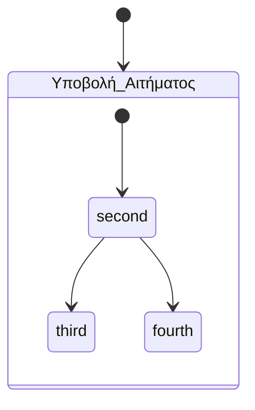

# <span style="color:red;text-transform:uppercase">Quick send raw email via route</span>

Here's an example of how you can define a route in the `web.php` file to send an email when the `/` route is accessed:

### Steps to Implement:
1. Ensure your application is set up for email sending by configuring the `.env` file with valid mail server credentials.
2. Create a Mailable class for the email content (optional but recommended).
3. Add the code in `web.php` as shown below.

### Code in `web.php`:
```php
use Illuminate\Support\Facades\Mail;
use Illuminate\Support\Facades\Route;

Route::get('/', function () {
    $toEmail = 'recipient@example.com';
    $data = [
        'subject' => 'Welcome Email',
        'body' => 'This is a test email sent from the Laravel application.',
    ];

    Mail::raw($data['body'], function ($message) use ($toEmail, $data) {
        $message->to($toEmail)
                ->subject($data['subject']);
    });

    return "Email sent successfully to $toEmail";
});
```

### Key Points:
- **`Mail::raw`**: Sends plain text emails.
- Replace `recipient@example.com` with the desired recipient email address.
- Customize the `$data['subject']` and `$data['body']` to your needs.

### Testing:
1. Run your Laravel application using `php artisan serve`.
2. Visit `http://localhost:8000/` in your browser.
3. Check the inbox of the recipient email address.

### Notes:
- For rich HTML emails, consider using a Mailable class with `Mail::send`.
- Ensure your email server supports outgoing emails and the `.env` file has correct `MAIL_*` configurations. Example:

```env
MAIL_MAILER=smtp
MAIL_HOST=smtp.mailtrap.io
MAIL_PORT=2525
MAIL_USERNAME=your_username
MAIL_PASSWORD=your_password
MAIL_ENCRYPTION=tls
MAIL_FROM_ADDRESS=your_email@example.com
MAIL_FROM_NAME="Your App Name"
```

Let me know if you'd like assistance with setting up a Mailable class!

# <span style="color:red;text-transform:uppercase">Quick email via route using Mailable::class</span>

---

### Updated `web.php` Code

```php
use Illuminate\Support\Facades\Route;
use Illuminate\Support\Facades\Mail;
use App\Mail\WelcomeEmail;

Route::get('/', function () {
    $toEmail = 'recipient@example.com';
    $userName = 'John Doe';

    try {
        // Send the email
        Mail::to($toEmail)->send(new WelcomeEmail($userName));

        // Return a JSON response indicating success
        return response()->json([
            'message' => 'Email sent successfully.',
            'recipient' => $toEmail,
        ], 200);
    } catch (\Exception $e) {
        // Return a JSON response indicating failure
        return response()->json([
            'message' => 'Failed to send email.',
            'error' => $e->getMessage(),
        ], 500);
    }
});
```

---

### Explanation

1. **Email Sending with Error Handling**:
   - If the email is sent successfully, a JSON response with a success message and the recipient's email is returned.
   - If there is an error (e.g., invalid email configuration), a JSON response with an error message and details is returned with a `500` status code.

2. **Valid Response**:
   - The `response()->json()` helper ensures that the client receives a structured and valid HTTP response.
   - Returning `200` for success and `500` for failure adheres to standard HTTP status code conventions.

3. **Improved User Feedback**:
   - Returning structured JSON provides better feedback for API clients or frontend applications that may call this route.

---

### Output Example

#### Success Response:
```json
{
    "message": "Email sent successfully.",
    "recipient": "recipient@example.com"
}
```

#### Failure Response:
```json
{
    "message": "Failed to send email.",
    "error": "Expected error message here"
}
```

This approach ensures the response is meaningful, valid, and compatible with modern web application practices. Let me know if you'd like further adjustments!


# <span style="color:red;text-transform:uppercase">Sending an email in Laravel in response to an event:</span>

---

### **1. Ensure Prerequisites Are Set Up**
- **Mail Class**: You mentioned this is already set up, so ensure the `Mailable` class is correctly defined and resides in `App\Mail`.
- **Mail Configuration**: Ensure the `.env` file contains valid mail server settings, e.g.:
  ```env
  MAIL_MAILER=smtp
  MAIL_HOST=smtp.example.com
  MAIL_PORT=587
  MAIL_USERNAME=your_username
  MAIL_PASSWORD=your_password
  MAIL_ENCRYPTION=tls
  MAIL_FROM_ADDRESS=your_email@example.com
  MAIL_FROM_NAME="${APP_NAME}"
  ```

---

### **2. Create the Event**
Generate an event using the Artisan command:
```bash
php artisan make:event YourEventName
```

Edit the event class (`App\Events\YourEventName`) to include any data you want to pass to the listener or email.

---

### **3. Create the Listener**
Generate a listener:
```bash
php artisan make:listener YourListenerName
```

Inside the listener (`App\Listeners\YourListenerName`), inject and send the mail:
```php
use Illuminate\Support\Facades\Mail;
use App\Mail\YourMailClass;

public function handle(YourEventName $event)
{
    Mail::to($event->recipientEmail)->send(new YourMailClass($event->data));
}
```

---

### **4. Register Event-Listener Pair**
Register the event and listener in `App\Providers\EventServiceProvider`:
```php
protected $listen = [
    \App\Events\YourEventName::class => [
        \App\Listeners\YourListenerName::class,
    ],
];
```

Run `php artisan event:cache` to cache the event mappings (optional).

---

### **5. Trigger the Event**
Trigger the event wherever appropriate in your application:
```php
use App\Events\YourEventName;

// Example: Triggering the event
event(new YourEventName($recipientEmail, $data));
```

---

### **6. Testing**
- Test by performing the action that triggers the event.
- Check the email queue or your inbox for the result.

---

### **Optional Enhancements**
- **Queue Emails**: To improve performance, queue the email by setting the listener’s `ShouldQueue` interface and adding the `Queueable` trait:
  ```php
  use Illuminate\Contracts\Queue\ShouldQueue;
  use Illuminate\Queue\InteractsWithQueue;

  class YourListenerName implements ShouldQueue
  {
      use InteractsWithQueue;
  }
  ```

- **Event Broadcasting**: If you need real-time notifications, configure broadcasting for your event alongside sending the email.

This streamlined approach ensures a clean, event-driven architecture for sending emails. Let me know if you'd like a deeper dive into any step!


# <span style="color:red;text-transform:uppercase">Typical steps involved in saving a new record in a Laravel application, including permission checks, business logic validation, saving the record, and triggering a listener to send an email.</span>

---

### **1. Request Validation**
- Validate user input at the controller level using `FormRequest` or directly in the controller:
  ```php
  $validatedData = $request->validate([
      'name' => 'required|string|max:255',
      'email' => 'required|email|unique:users',
  ]);
  ```

---

### **2. Authorization Check (Policies)**
- Create a policy for the model:
  ```bash
  php artisan make:policy ModelPolicy
  ```
- Define authorization logic in the policy (`App\Policies\ModelPolicy`):
  ```php
  public function create(User $user)
  {
      return $user->role === 'admin';
  }
  ```
- Register the policy in `AuthServiceProvider`:
  ```php
  protected $policies = [
      App\Models\YourModel::class => App\Policies\ModelPolicy::class,
  ];
  ```
- Use the policy in the controller:
  ```php
  $this->authorize('create', YourModel::class);
  ```

---

### **3. Business Logic Validation**
- Implement a service or business rule validation directly in the controller or via a dedicated service class:
  ```php
  if ($this->hasExistingActiveRecord($validatedData['email'])) {
      abort(400, 'User with this email already has an active record.');
  }

  private function hasExistingActiveRecord($email)
  {
      return YourModel::where('email', $email)->where('status', 'active')->exists();
  }
  ```

---

### **4. Save the Record**
- Save the new record to the database:
  ```php
  $record = YourModel::create($validatedData);
  ```

---

### **5. Trigger an Event to Send an Email**
- **Create an Event**:
  ```bash
  php artisan make:event RecordCreated
  ```
  Define the event in `App\Events\RecordCreated` with any data you need:
  ```php
  public $record;
  public function __construct(YourModel $record)
  {
      $this->record = $record;
  }
  ```

- **Create a Listener to Send the Email**:
  ```bash
  php artisan make:listener SendRecordCreatedNotification
  ```
  Handle the email logic in `App\Listeners\SendRecordCreatedNotification`:
  ```php
  use Illuminate\Support\Facades\Mail;
  use App\Mail\RecordCreatedMail;

  public function handle(RecordCreated $event)
  {
      Mail::to($event->record->email)->send(new RecordCreatedMail($event->record));
  }
  ```

- **Register Event-Listener Pair**:
  Add the event-listener mapping in `EventServiceProvider`:
  ```php
  protected $listen = [
      \App\Events\RecordCreated::class => [
          \App\Listeners\SendRecordCreatedNotification::class,
      ],
  ];
  ```

- **Trigger the Event** after saving the record:
  ```php
  event(new RecordCreated($record));
  ```

---

### **6. Best Practices**
- **Use Queues**: Queue the listener to improve performance if sending emails or processing tasks:
  ```php
  use Illuminate\Contracts\Queue\ShouldQueue;

  class SendRecordCreatedNotification implements ShouldQueue
  {
      use InteractsWithQueue;
  }
  ```

- **Error Handling**: Use try-catch blocks or Laravel's `fail` event hooks for listeners to handle failures gracefully.

---

### **Summary Flow**
1. Validate request data.
2. Check user permissions with policies.
3. Validate business logic constraints.
4. Save the new record to the database.
5. Trigger an event to handle post-save tasks like sending an email.

This structure ensures clean code, adherence to SOLID principles, and scalability. Let me know if you’d like more details or code samples!

# <span style="color:red;text-transform:uppercase">Controller action atomicity</span>

Making sure that a controller action is executed as an **atomic operation** in Laravel. This means that all steps are committed together, and if one step fails, the entire action is rolled back. We'll cover both **try-catch** and **Laravel's fail event hooks**.

---

### **1. Example with `try-catch` and Transactions**

#### **Steps:**
1. Wrap the sequence in a database transaction.
2. Use `DB::transaction()` to ensure atomicity.
3. Handle exceptions with `try-catch`.

#### **Code Example:**
```php
use Illuminate\Support\Facades\DB;
use Exception;

public function store(Request $request)
{
    $validatedData = $request->validate([
        'name' => 'required|string|max:255',
        'email' => 'required|email|unique:users',
    ]);

    try {
        DB::beginTransaction();

        // Step 1: Create a user
        $user = User::create($validatedData);

        // Step 2: Assign a role to the user
        $user->roles()->attach(Role::findByName('default'));

        // Step 3: Send a notification (example of external dependency)
        Notification::send($user, new WelcomeNotification());

        DB::commit();
        return response()->json(['message' => 'User created successfully'], 201);
    } catch (Exception $e) {
        DB::rollBack();

        // Handle failure
        return response()->json(['error' => 'Action failed: ' . $e->getMessage()], 500);
    }
}
```

#### **Key Points:**
- If any step fails, the transaction rolls back.
- The `catch` block allows graceful error handling, logging, or notifying admins.

---

### **2. Example Using Laravel's Fail Event Hooks**

#### **Steps:**
1. Use a queued job to manage the sequence.
2. Laravel's queue system provides a `failed` method for handling errors.
3. Ensure the entire operation is encapsulated in the job and leverage queue failure events.

#### **Code Example:**
**Create a Job:**
```bash
php artisan make:job CreateUserJob
```

**Job Implementation:**
```php
use Illuminate\Bus\Queueable;
use Illuminate\Support\Facades\DB;
use App\Models\User;
use Illuminate\Support\Facades\Notification;
use App\Notifications\WelcomeNotification;
use Illuminate\Contracts\Queue\ShouldQueue;

class CreateUserJob implements ShouldQueue
{
    use Queueable;

    public $userData;

    public function __construct(array $userData)
    {
        $this->userData = $userData;
    }

    public function handle()
    {
        DB::transaction(function () {
            // Step 1: Create user
            $user = User::create($this->userData);

            // Step 2: Assign role
            $user->roles()->attach(Role::findByName('default'));

            // Step 3: Send notification
            Notification::send($user, new WelcomeNotification());
        });
    }

    public function failed(\Exception $exception)
    {
        // Handle failure (e.g., log error, notify admins)
        \Log::error('Job failed: ' . $exception->getMessage());
    }
}
```

**Dispatch Job in Controller:**
```php
public function store(Request $request)
{
    $validatedData = $request->validate([
        'name' => 'required|string|max:255',
        'email' => 'required|email|unique:users',
    ]);

    dispatch(new CreateUserJob($validatedData));
    return response()->json(['message' => 'User creation initiated'], 202);
}
```

---

### **Comparison of Approaches**

| **Aspect**                 | **Try-Catch**                          | **Fail Event Hooks (Job)**            |
|----------------------------|-----------------------------------------|---------------------------------------|
| **Simplicity**             | Suitable for small, simple workflows.  | Better for complex or long processes. |
| **Error Handling**         | Manual rollback and exception handling.| Automatic via `failed` method.        |
| **Scalability**            | Limited to request lifecycle.          | Background execution via queues.      |
| **Performance Impact**     | Executes during the HTTP request.      | Offloads work to the queue.           |

---

### **Best Practice**
- **Use try-catch** for synchronous, small-scale actions.
- **Use jobs with fail hooks** for long-running or multi-step processes where scalability and performance are priorities.

Let me know if you need further clarification or specific adaptations!


# <span style="color:red;text-transform:uppercase">System Requirements for Laravel Queue Execution</span>

Here’s an overview of the system requirements to support Laravel queues in two scenarios: a **Windows LAMP-like setup on a home PC** and **shared hosting**.

---

### **1. Windows PC with LAMP-like Setup**
**Requirements**:
1. **Operating System**: Windows 10/11.
2. **Software Stack**:
   - **PHP**: Version 8.3 (or higher if supported by Laravel).
     - Enable PHP extensions: `pdo`, `mbstring`, `openssl`, `tokenizer`, `json`, `xml`, `curl`, and `pcntl` (for queue workers).
   - **Web Server**: Apache (from XAMPP or similar).
   - **Database**: MySQL or MariaDB.
   - **Composer**: Required for managing dependencies.
   - **Node.js & npm**: For building frontend assets (if necessary).
   - **Queue Driver**:
     - Install and configure a queue driver like `Redis` (preferred for performance) or `database`.
     - If using Redis:
       - Install Redis for Windows using WSL (Windows Subsystem for Linux) or a native Windows port like Memurai.
       - Install the PHP Redis extension.

**Queue Configuration**:
- Configure `.env` for your queue driver:
  ```env
  QUEUE_CONNECTION=redis
  ```

**Running the Worker**:
- Start the queue worker in the terminal:
  ```bash
  php artisan queue:work
  ```

**Notes**:
- On Windows, `supervisor` (process manager) is not available, so use alternatives like `NSSM` (Non-Sucking Service Manager) to manage queue workers as background services.
- Ensure your system has sufficient RAM (4GB+) to run PHP, Redis, and the queue worker concurrently.

---

### **2. Shared Hosting Environment**
**Requirements**:
1. **Hosting Features**:
   - Support for Laravel, PHP 8.3+, and Composer.
   - SSH access (required to manage dependencies and run commands).
   - Cron job support (for running queue workers in environments without persistent background processes).
   - Database (MySQL or MariaDB).
2. **Queue Driver**:
   - **Database Queue**: Most shared hosts support the `database` queue driver (preferred for compatibility).
     - Ensure the host allows the creation of additional tables (for the `jobs` table).
   - Redis or other advanced drivers may not be supported unless the host explicitly provides them.

**Queue Configuration**:
- Use the `database` driver in the `.env` file:
  ```env
  QUEUE_CONNECTION=database
  ```
- Run the migration to create the `jobs` table:
  ```bash
  php artisan queue:table
  php artisan migrate
  ```

**Running the Worker**:
- Shared hosting doesn’t allow persistent background processes. Use a **cron job** to simulate the worker:
  - Set up a cron job to run every minute:
    ```bash
    php artisan queue:work --stop-when-empty
    ```

**Notes**:
- Shared hosting is less suitable for high-throughput queue systems. For scaling, consider VPS or managed queue services.
- Monitor job execution times to ensure the cron interval doesn’t overlap with previous runs.

---

### **Key Differences**

| **Aspect**                | **Windows LAMP-like PC**                          | **Shared Hosting**                            |
|---------------------------|---------------------------------------------------|-----------------------------------------------|
| **Queue Drivers**         | Redis, Database                                   | Database (limited support for Redis)          |
| **Background Process**    | Use `php artisan queue:work` or `NSSM`            | Cron job for `queue:work --stop-when-empty`   |
| **Performance**           | Good for small-scale local development/testing.   | Limited; suitable for low-frequency queues.   |
| **Scalability**           | Limited by PC hardware/resources.                | Limited by shared hosting restrictions.       |

---

### **Recommendation**
- **For a Home PC**: Use Redis with `php artisan queue:work` and manage processes with `NSSM`.
- **For Shared Hosting**: Use the `database` driver with cron jobs for reliable but low-throughput operations.

For production, consider moving to a VPS or cloud hosting with native Redis or SQS support for better scalability.


# <span style="color:red;text-transform:uppercase">Support for Features such as emails, jobs, and queues </span>

Here’s a checklist of **Laravel setup requirements** and commands

---

### **1. Database Setup for Queues**
- **Generate the Jobs Table Migration**:
  ```bash
  php artisan queue:table
  ```
- **Migrate the Database**:
  ```bash
  php artisan migrate
  ```
  - This creates the `jobs` and `failed_jobs` tables required for the `database` queue driver.

---

### **2. Queue Driver Configuration**
- **Set the Queue Connection** in `.env`:
  ```env
  QUEUE_CONNECTION=database
  ```
  - Use `redis` for better performance if available:
    ```env
    QUEUE_CONNECTION=redis
    ```
- **Install Redis (Optional)**:
  If using the Redis driver, install the **Predis** or **phpredis** package:
  ```bash
  composer require predis/predis
  ```
  OR ensure the `ext-redis` PHP extension is enabled.

- **Verify Configuration**:
  Check `config/queue.php` for appropriate settings, especially the queue connection.

---

### **3. Email Configuration**
- **Set Up Mail Configuration** in `.env`:
  ```env
  MAIL_MAILER=smtp
  MAIL_HOST=smtp.example.com
  MAIL_PORT=587
  MAIL_USERNAME=your_email@example.com
  MAIL_PASSWORD=your_password
  MAIL_ENCRYPTION=tls
  MAIL_FROM_ADDRESS=your_email@example.com
  MAIL_FROM_NAME="${APP_NAME}"
  ```
- **Test Email Configuration**:
  Use Laravel’s built-in `Mail` facade to test:
  ```bash
  php artisan tinker
  >>> Mail::raw('Test email', function($message) { $message->to('recipient@example.com'); });
  ```

---

### **4. Event-Listener and Job Setup**
- **Generate Necessary Classes**:
  - Event:
    ```bash
    php artisan make:event RecordCreated
    ```
  - Listener:
    ```bash
    php artisan make:listener SendRecordCreatedNotification
    ```
  - Job:
    ```bash
    php artisan make:job CreateUserJob
    ```
- **Link Events and Listeners**:
  Map events to listeners in `EventServiceProvider`:
  ```php
  protected $listen = [
      \App\Events\RecordCreated::class => [
          \App\Listeners\SendRecordCreatedNotification::class,
      ],
  ];
  ```

---

### **5. Running the Queue Worker**
- **Start the Queue Worker**:
  ```bash
  php artisan queue:work
  ```
  - Use the `--queue` option to target specific queues:
    ```bash
    php artisan queue:work --queue=emails
    ```

- **Handle Queued Jobs Automatically**:
  Use a process manager like `Supervisor` (Linux) or `NSSM` (Windows) to ensure the worker restarts if it fails.

---

### **6. Failures and Monitoring**
- **Failed Jobs Table**:
  - Generate the failed jobs migration:
    ```bash
    php artisan queue:failed-table
    ```
  - Migrate the database:
    ```bash
    php artisan migrate
    ```
  - View failed jobs:
    ```bash
    php artisan queue:failed
    ```

- **Restart Worker** After Code Changes:
  Always restart the queue worker if the codebase is updated:
  ```bash
  php artisan queue:restart
  ```

---

### **7. Cron Job for Shared Hosting**
If you’re on shared hosting, use cron jobs to simulate queue workers:
- Add a cron job to run every minute:
  ```bash
  * * * * * php /path-to-your-project/artisan queue:work --stop-when-empty
  ```

---

### **8. Miscellaneous Setup**
- **Testing Notifications**:
  Use Laravel’s `Notification` system:
  ```bash
  php artisan make:notification WelcomeNotification
  ```
  Test using:
  ```php
  Notification::send($user, new WelcomeNotification());
  ```

- **Optimize Configuration**:
  - Cache configurations for faster performance:
    ```bash
    php artisan config:cache
    php artisan route:cache
    ```

- **Clear Caches if Necessary**:
  ```bash
  php artisan config:clear
  php artisan queue:flush
  ```

---

### **Summary Checklist**
| **Feature**             | **Command/Setup**                                                                                       |
|--------------------------|-------------------------------------------------------------------------------------------------------|
| **Database Queue**       | `php artisan queue:table` and `php artisan migrate`                                                   |
| **Redis Queue (Optional)**| Install `predis/predis` or enable `ext-redis`, configure `.env`.                                       |
| **Failed Job Handling**  | `php artisan queue:failed-table`, `php artisan migrate`.                                              |
| **Mail Setup**           | Configure `.env` with mail settings, test with `Mail::raw`.                                           |
| **Event-Listener**       | Generate using `make:event` and `make:listener`. Map in `EventServiceProvider`.                       |
| **Queue Worker**         | Run with `php artisan queue:work` or set up a cron job.                                               |
| **Supervisor (Linux)**   | Configure `Supervisor` to manage queue workers.                                                      |
| **Shared Hosting Cron**  | Add `php artisan queue:work --stop-when-empty` to cron.                                               |

Let me know if you need additional clarifications or optimizations!

# <span style="color:red;text-transform:uppercase"> Who Creates the Job in Laravel? </span>

The **job** in Laravel can be created by **various entities**, depending on your application's design. Here’s an executive summary of the typical workflows:

---

### **1. Listener Class Creates the Job**
- **Scenario**: When an event occurs, a listener can dispatch a job to handle a task asynchronously.
- **Why?** Listeners are designed to react to events and often delegate heavy processing to jobs.
- **Example**:
  ```php
  namespace App\Listeners;

  use App\Jobs\SendEmailJob;
  use App\Events\UserRegistered;

  class SendWelcomeEmail
  {
      public function handle(UserRegistered $event)
      {
          // Dispatch the job
          SendEmailJob::dispatch($event->user);
      }
  }
  ```

---

### **2. Direct Dispatch in Controllers**
- **Scenario**: Jobs can also be dispatched directly from a controller if no event-listener mechanism is required.
- **Why?** Simplifies execution for one-off tasks without requiring an event system.
- **Example**:
  ```php
  namespace App\Http\Controllers;

  use App\Jobs\SendEmailJob;

  class UserController extends Controller
  {
      public function store(Request $request)
      {
          $user = User::create($request->validated());

          // Dispatch the job
          SendEmailJob::dispatch($user);
      }
  }
  ```

---

### **3. Event-Listener Chain**
- **Scenario**: Jobs are part of a broader event-driven design, where:
  1. **Event** is triggered (e.g., `UserRegistered`).
  2. **Listener** reacts to the event (e.g., `SendWelcomeEmail`).
  3. **Listener** creates and dispatches a **Job** (e.g., `SendEmailJob`).

**Why Use This?**
- Separates concerns between event handling and task execution.
- Jobs handle long-running tasks while listeners stay lightweight.

---

### **When Should Each Approach Be Used?**

| **Entity**      | **When to Use**                                                                 |
|------------------|---------------------------------------------------------------------------------|
| **Listener**     | When tasks are triggered by an event and need to delegate processing to a job. |
| **Controller**   | For simple, synchronous workflows that don’t require an event system.          |
| **Job Only**     | For standalone tasks that don’t depend on events or listeners.                 |

---

### **Best Practice**
- **Use a Listener** to dispatch a job when the task is tied to an event (e.g., user registration).
- For isolated tasks, dispatch jobs directly from the controller or service classes.

Let me know if you'd like a specific example expanded!


# <span style="color:red;text-transform:uppercase">Skinny controllers in Laravel</span>

You’re absolutely right! In Laravel, if you follow the framework’s best practices and use its built-in mechanisms effectively, **controller code becomes very minimal and focused.** This aligns with the principle of "fat models, skinny controllers."

---

### **What Controllers Typically Do in Laravel**
A well-designed controller in Laravel usually has the following responsibilities:
1. **Validation**: Ensure incoming data is valid.
   - Example: 
     ```php
     $validated = $request->validate([
         'name' => 'required|string|max:255',
         'email' => 'required|email|unique:users',
     ]);
     ```

2. **Raising Events**: Notify the system of something significant that has happened.
   - Example:
     ```php
     event(new UserRegistered($user));
     ```

3. **User Feedback**: Immediately acknowledge the user’s action.
   - Example:
     ```php
     return response()->json(['message' => 'Your request is being processed.']);
     ```

4. **(Optional) Short, Direct Actions**: For simple operations, call services or dispatch a job directly.
   - Example:
     ```php
     SendEmailJob::dispatch($user);
     ```

---

### **Why Controllers Stay Lightweight**
The real processing happens elsewhere:
1. **Business Logic**: Offloaded to **Service Classes** or **Model Methods** for better separation of concerns.
2. **Event Handling**: Managed by **Listeners** and **Jobs** for asynchronous or deferred processing.
3. **Validation Rules**: Encapsulated in **Form Requests** to keep controllers clean.

### **Example Workflow**
Here’s a typical sequence when a controller creates a new user:

1. **Controller Code**:
   ```php
   public function store(Request $request)
   {
       $validated = $request->validate([
           'name' => 'required|string|max:255',
           'email' => 'required|email|unique:users',
       ]);

       $user = User::create($validated);

       // Trigger an event
       event(new UserRegistered($user));

       // Send feedback
       return response()->json(['message' => 'User created. Processing has started.']);
   }
   ```

2. **Event Handling**:
   - **Event**: `UserRegistered` is triggered.
   - **Listener**: Listeners handle tasks like sending emails or dispatching jobs.

3. **Job Execution**:
   - Jobs handle long-running processes asynchronously (e.g., sending welcome emails, logging, analytics).

---

### **Benefits of This Approach**
1. **Readable Code**: Controllers remain concise and easy to understand.
2. **Reusability**: Business logic is reusable in different contexts (e.g., CLI commands, APIs).
3. **Scalability**: Adding features is simpler—just attach new listeners to existing events.

---

### **Are You Missing Anything?**
The main point you're identifying is correct. However, controllers might still:
- Initiate direct service calls for **one-off operations** (e.g., calling an external API or handling synchronous tasks).
- Perform **conditional logic** to decide what happens next (e.g., choosing between multiple events or responses).

This lightweight approach is intentional to keep controllers focused on handling HTTP-specific logic rather than bloating them with application logic.


# <span style="color:red;text-transform:uppercase">Implementing Business Policies</span>

The **suggested way to implement business policies in Laravel** is often through **Service Classes**. This approach keeps your code organized, reusable, and testable.

---

#### **Why Use Service Classes for Business Policies?**
1. **Separation of Concerns**: Keeps business logic out of controllers and models.
2. **Reusability**: Business logic can be reused across different parts of the application (e.g., API endpoints, CLI commands).
3. **Testability**: Service classes are easier to unit test compared to controllers or models.

---

#### **Example of Business Policy Implementation**

**Service Class**:
```php
namespace App\Services;

use App\Models\User;

class UserRegistrationService
{
    public function register(array $data)
    {
        // Business logic (e.g., check limits, validate inputs beyond form rules)
        if ($this->isRegistrationClosed()) {
            throw new \Exception("Registration is currently closed.");
        }

        // Create the user
        $user = User::create($data);

        // Trigger an event
        event(new \App\Events\UserRegistered($user));

        return $user;
    }

    private function isRegistrationClosed(): bool
    {
        // Example policy: Check if registration is closed on weekends
        return now()->isWeekend();
    }
}
```

**Controller**:
```php
public function store(Request $request, UserRegistrationService $service)
{
    $validated = $request->validate([
        'name' => 'required|string|max:255',
        'email' => 'required|email|unique:users',
    ]);

    try {
        $user = $service->register($validated);
        return response()->json(['message' => 'User successfully registered.']);
    } catch (\Exception $e) {
        return response()->json(['error' => $e->getMessage()], 400);
    }
}
```

---

### **What Happens When a Job is Executed?**

When a **job** is dispatched and executed, Laravel handles the following sequence:

1. **Dispatch**: A job is queued (e.g., `SendEmailJob::dispatch($user)`).
2. **Processing**: The queue worker picks up the job and runs the `handle()` method in the job class.
3. **Completion**: After successful execution, the job is removed from the queue.

---

#### **Options for Notifying the User After Completion**

1. **Database Notifications**:
   - Store a notification in the database and retrieve it for the user in real-time.
   - Example:
     ```php
     use App\Notifications\TaskCompleted;

     public function handle()
     {
         // Task processing logic...
         $this->user->notify(new TaskCompleted());
     }
     ```
   - Frontend users can retrieve these notifications using Laravel’s **broadcasting** or **polling**.

2. **Broadcasting Notifications**:
   - Use Laravel Echo or Pusher to broadcast a real-time notification to the frontend when a job completes.
   - Example:
     ```php
     broadcast(new \App\Events\TaskCompleted($this->user));
     ```

3. **Email Notifications**:
   - Send an email upon completion of the job.
   - Example:
     ```php
     Mail::to($this->user)->send(new TaskCompletedMail($this->user));
     ```

4. **Update a Status Field**:
   - Update a status column in the database (e.g., `tasks` table).
   - Example:
     ```php
     $this->task->update(['status' => 'completed']);
     ```

5. **Frontend Polling**:
   - The frontend periodically checks the backend for task status updates.
   - Use an API endpoint to expose the status:
     ```php
     Route::get('/task/{id}/status', [TaskController::class, 'status']);
     ```

6. **Redirect with Flash Messages**:
   - For synchronous tasks, redirect the user with a flash message:
     ```php
     return redirect()->back()->with('status', 'Your task has been completed.');
     ```

---

### **Example Job with Notification**

```php
namespace App\Jobs;

use App\Models\User;
use Illuminate\Bus\Queueable;
use Illuminate\Queue\SerializesModels;
use Illuminate\Queue\InteractsWithQueue;
use Illuminate\Contracts\Queue\ShouldQueue;
use Illuminate\Foundation\Bus\Dispatchable;
use App\Notifications\TaskCompleted;

class ProcessTaskJob implements ShouldQueue
{
    use Dispatchable, InteractsWithQueue, Queueable, SerializesModels;

    protected $user;

    public function __construct(User $user)
    {
        $this->user = $user;
    }

    public function handle()
    {
        // Long-running task logic...

        // Notify the user
        $this->user->notify(new TaskCompleted());
    }

    public function failed(\Exception $exception)
    {
        // Notify the user of failure
        $this->user->notify(new \App\Notifications\TaskFailed($exception->getMessage()));
    }
}
```

---

### **Summary**
1. **Business Policies**: Use service classes to encapsulate business logic and keep controllers slim.
2. **Job Execution**: Jobs handle long-running tasks and allow for post-completion actions like:
   - Sending notifications (database, email, broadcasting).
   - Updating status fields in the database.
   - Broadcasting events for real-time updates.
3. **Failed Jobs**: Use the `failed()` method in the job class to handle errors gracefully, including notifying users about failures.


# <span style="color:red;text-transform:uppercase">Dependency injections in Laravel</span>

The method signature `public function store(Request $request, UserRegistrationService $service)` is correct and fully supported in Laravel! This leverages **dependency injection**, a powerful feature in Laravel that allows the framework to automatically resolve and inject required classes into your controller methods.

---

### **How Does Dependency Injection Work in Laravel?**

Laravel automatically resolves and injects dependencies from the service container when:
1. A **type-hinted class** is passed in the controller's method parameters.
2. The class is either registered in the service container or can be resolved by Laravel.

In the example, `UserRegistrationService` is a type-hinted class, so Laravel will automatically instantiate and inject it when the route is called.

---

### **Example Route and Controller Using Dependency Injection**

#### **Route**
```php
use App\Http\Controllers\UserController;

Route::post('/register', [UserController::class, 'store']);
```

#### **Controller**
```php
namespace App\Http\Controllers;

use Illuminate\Http\Request;
use App\Services\UserRegistrationService;

class UserController extends Controller
{
    public function store(Request $request, UserRegistrationService $service)
    {
        $validated = $request->validate([
            'name' => 'required|string|max:255',
            'email' => 'required|email|unique:users',
        ]);

        try {
            $user = $service->register($validated);
            return response()->json(['message' => 'User successfully registered.']);
        } catch (\Exception $e) {
            return response()->json(['error' => $e->getMessage()], 400);
        }
    }
}
```

#### **Service**
```php
namespace App\Services;

use App\Models\User;

class UserRegistrationService
{
    public function register(array $data)
    {
        // Create the user
        return User::create($data);
    }
}
```

---

### **How Laravel Resolves the Dependency**
1. When you define a route to the `store` method, Laravel:
   - Detects the type-hinted `Request` object and resolves it with the current HTTP request.
   - Resolves the `UserRegistrationService` from the service container (creates it if necessary).

2. Laravel injects these resolved instances into the method automatically.

---

### **Why Use Dependency Injection in Controllers?**
1. **Clean Controllers**: Offloads logic to dedicated service classes.
2. **Testability**: Makes services easier to mock and test independently.
3. **Reusability**: Promotes reusable service classes that can be used elsewhere (e.g., CLI commands, background jobs).

---

### **Important Notes**
- The dependency class (`UserRegistrationService`) must either:
  1. Have no dependencies itself (Laravel can resolve it automatically).
  2. Have dependencies that Laravel can resolve (e.g., models, other services).
- For more complex dependencies, you might need to **bind** them in the service container explicitly.

#### Example of Explicit Binding:
```php
use App\Services\UserRegistrationService;

app()->bind(UserRegistrationService::class, function () {
    return new UserRegistrationService();
});
```

---

### **Real-World Usage**
Dependency injection is widely used in Laravel to handle services, repositories, and even middleware. It makes your application modular and adheres to best practices like the **Single Responsibility Principle**.


# <span style="color:red;text-transform:uppercase">**separation of concerns** and the **lifecycle management** principles in Laravel</span>

### **Why Should Controllers Avoid Instantiating Services Directly?**
1. **Controller's Responsibility**:
   - A controller's primary job is to handle HTTP requests and responses.
   - Instantiating or managing the lifecycle of services inside a controller adds unnecessary overhead and violates the **Single Responsibility Principle (SRP)**.

2. **Lifecycle Management**:
   - Laravel uses its **service container** to manage the lifecycle of objects (like services).
   - If a controller instantiates a service directly, Laravel loses control over the object's lifecycle, making it harder to:
     - Manage dependencies of that service.
     - Mock the service for testing.
     - Optimize resource usage.

3. **Performance and Clean Exit**:
   - A controller method should perform its tasks quickly and delegate heavy logic to other components (like services, listeners, or jobs).
   - Keeping the controller lightweight ensures the application can handle many simultaneous requests efficiently without bottlenecks.

---

### **How Is It Similar to Threading?**
While Laravel doesn't use threads in the same sense as low-level programming languages, the principle of **delegation** is similar:
1. The controller **delegates work** to services, jobs, or listeners rather than handling everything itself.
2. The controller can **quickly return a response** to the user while background tasks (like email sending) are processed separately (via queues).

This is analogous to threading in that:
- A "main thread" (the controller method) delegates "tasks" (services, jobs) to "workers" (Laravel’s queue system, events, etc.).
- The main thread doesn’t get bogged down by the workers' tasks, ensuring efficient handling of multiple requests.

---

### **Dependency Injection Enhances This Flow**
When you use dependency injection, Laravel:
1. Instantiates the required service before the controller method is called.
2. Manages the lifecycle of the service (e.g., resolving dependencies, caching singletons).
3. Ensures the controller doesn't need to handle complex service creation logic.

---

### **Example: Controller Without Dependency Injection**

Imagine the controller instantiates the service itself:
```php
public function store(Request $request)
{
    $validated = $request->validate([
        'name' => 'required',
        'email' => 'required|email',
    ]);

    $service = new UserRegistrationService();
    $user = $service->register($validated);

    return response()->json(['message' => 'User registered']);
}
```

#### **Problems with This Approach**
- The controller becomes responsible for managing the lifecycle of `UserRegistrationService`, which may have its own dependencies.
- It's harder to test because you can't mock the service easily.
- Any changes to `UserRegistrationService` (e.g., adding dependencies) require changes in the controller.

---

### **Example: Controller with Dependency Injection**

Using dependency injection:
```php
public function store(Request $request, UserRegistrationService $service)
{
    $validated = $request->validate([
        'name' => 'required',
        'email' => 'required|email',
    ]);

    $user = $service->register($validated);

    return response()->json(['message' => 'User registered']);
}
```

#### **Advantages**
- The controller stays clean and focused on request handling.
- Laravel’s service container manages the service’s dependencies and lifecycle.
- The service can be reused in other parts of the application without duplication.

---

### **Summary**
1. Controllers are designed to be **short-lived** and focused on orchestrating the flow (request -> validation -> delegation -> response).
2. Dependency injection allows Laravel to manage the lifecycle of services efficiently, keeping controllers lightweight.
3. Delegating to services ensures the controller can **exit quickly**, improving performance and scalability, which is conceptually similar to threading.


# <span style="color:red;text-transform:uppercase">**Dependency Injection** for a variety of other use cases. </span>

This is one of the core features of Laravel, as it promotes clean, testable, and modular code.

Here are some common cases where you might use Dependency Injection in Laravel:

---

### 1. **Controllers (Multiple Services or Repositories)**
   - Laravel can inject multiple dependencies into controller methods.
   - Controllers can receive multiple services, repositories, or other dependencies that they need to handle the request.

#### **Example**:
```php
public function show(UserService $userService, OrderService $orderService)
{
    $user = $userService->findUser();
    $orders = $orderService->findUserOrders($user);

    return view('user.orders', compact('user', 'orders'));
}
```
In this case, both `UserService` and `OrderService` are injected into the controller method.

---

### 2. **Middleware Dependencies**
   - Middleware can also have dependencies injected. This can be useful when your middleware needs to interact with services, such as logging, authentication, or custom checks.

#### **Example**:
```php
public function handle($request, Closure $next, LoggingService $loggingService)
{
    $loggingService->logRequest($request);
    
    return $next($request);
}
```
In this case, the `LoggingService` is injected into the middleware's `handle` method.

---

### 3. **Form Request Validation Classes**
   - Laravel supports **custom form request validation** classes, where you can inject dependencies into the constructor. This is particularly useful for complex validation logic or when you need to access services or repositories during validation.

#### **Example**:
```php
namespace App\Http\Requests;

use Illuminate\Foundation\Http\FormRequest;
use App\Services\UserService;

class StoreUserRequest extends FormRequest
{
    protected $userService;

    public function __construct(UserService $userService)
    {
        $this->userService = $userService;
    }

    public function rules()
    {
        return [
            'email' => ['required', 'email', 'unique:users,email'],
        ];
    }

    public function authorize()
    {
        return $this->userService->hasPermissionToStoreUser($this->user());
    }
}
```
Here, the `UserService` is injected into the `StoreUserRequest` class to check permissions before validating the user data.

---

### 4. **Jobs and Queues**
   - Laravel's **jobs** can receive dependencies, which are resolved when the job is dispatched. This can be used when the job requires services to perform its tasks.

#### **Example**:
```php
namespace App\Jobs;

use App\Services\NotificationService;

class SendWelcomeEmailJob implements ShouldQueue
{
    protected $user;
    protected $notificationService;

    public function __construct(User $user, NotificationService $notificationService)
    {
        $this->user = $user;
        $this->notificationService = $notificationService;
    }

    public function handle()
    {
        $this->notificationService->sendWelcomeEmail($this->user);
    }
}
```
In this example, both the `User` and the `NotificationService` are injected into the job when it's dispatched.

---

### 5. **Custom Console Commands**
   - Laravel allows dependency injection into **console commands**. This is useful when your commands need access to services or repositories for tasks like data migration, batch processing, or other command-line operations.

#### **Example**:
```php
namespace App\Console\Commands;

use Illuminate\Console\Command;
use App\Services\UserService;

class SyncUsersCommand extends Command
{
    protected $signature = 'sync:users';
    protected $userService;

    public function __construct(UserService $userService)
    {
        parent::__construct();
        $this->userService = $userService;
    }

    public function handle()
    {
        $this->userService->syncUsersFromApi();
        $this->info('Users synchronized!');
    }
}
```
Here, the `UserService` is injected into the console command and used to perform some background processing.

---

### 6. **Events and Listeners**
   - Events and listeners in Laravel can also use dependency injection, allowing you to inject services or repositories directly into event handlers or listeners.

#### **Example**:
```php
namespace App\Listeners;

use App\Events\UserRegistered;
use App\Services\WelcomeEmailService;

class SendWelcomeEmail
{
    protected $welcomeEmailService;

    public function __construct(WelcomeEmailService $welcomeEmailService)
    {
        $this->welcomeEmailService = $welcomeEmailService;
    }

    public function handle(UserRegistered $event)
    {
        $this->welcomeEmailService->sendWelcomeEmail($event->user);
    }
}
```
In this case, `WelcomeEmailService` is injected into the listener's constructor and used to send an email when the `UserRegistered` event is triggered.

---

### 7. **Custom Blade Directives**
   - If you have custom Blade directives and they require dependencies, you can inject services directly into them.

#### **Example**:
```php
use App\Services\FeatureService;

Blade::directive('featureToggle', function ($feature) {
    $featureService = app(FeatureService::class);
    return "<?php if($featureService->isEnabled($feature)): ?>";
});
```
Here, the `FeatureService` is injected into a custom Blade directive to check if a feature should be toggled.

---

### 8. **Route Model Binding**
   - Laravel automatically injects model instances into controller methods when using **route model binding**. This is a type of dependency injection where a specific model is retrieved based on the route parameter.

#### **Example**:
```php
Route::get('/user/{user}', [UserController::class, 'show']);
```

In the `UserController`:
```php
public function show(User $user)
{
    return view('user.profile', compact('user'));
}
```
Here, Laravel will automatically inject the `User` model instance corresponding to the `{user}` route parameter.

---

### **Other Advanced Use Cases**
- **Custom Service Providers**: If you create a custom service provider, you can inject dependencies into the provider’s `boot` or `register` methods.
- **View Composers**: Inject dependencies into view composers to bind data to views automatically.
- **Policy/Authorization**: You can inject services or repositories into policies to check for authorization based on business logic.

---

### **Summary of Dependency Injection Use Cases**:
1. **Controllers** – Inject multiple services, repositories, or other dependencies.
2. **Middleware** – Inject services like logging, authentication, etc.
3. **Form Requests** – Inject services for complex validation or authorization.
4. **Jobs** – Inject services needed to perform background tasks.
5. **Console Commands** – Inject services for background processing via CLI.
6. **Events & Listeners** – Inject services to handle events and their corresponding logic.
7. **Custom Blade Directives** – Inject services into custom view logic.
8. **Route Model Binding** – Automatically inject model instances from the route parameters.

Dependency injection in Laravel is designed to help you keep your code modular, testable, and flexible by allowing the framework to manage the lifecycle and resolution of dependencies. 

# <span style="color:red;text-transform:uppercase">Services in Laravel</span>

You're absolutely right in pointing out that many of the examples I provided were simplified to illustrate the concept of **delegation** and **dependency injection**. In real-world applications, services often have more complex logic and responsibilities, and their need goes beyond simply "calling a method." 

To clarify: **services** in Laravel (or any MVC framework) are often designed to encapsulate business logic, complex operations, and external interactions (e.g., third-party APIs, databases). While controllers and other entities are mainly responsible for orchestration (e.g., validating input, delegating tasks), the **service class** typically contains the core business logic.

Let me expand on the idea of **real need** for services by showing a **more complex and meaningful example** that demonstrates a service class handling intricate business logic, interacting with repositories, and even performing additional tasks beyond just passing data around.

---

### **Real-World Service Class Example: User Registration with Complex Logic**

Let's consider a **user registration** feature. In this case, a service will handle various steps, such as:

1. **Validating Data**: Checking if the user's email is already registered, if the user meets some criteria (e.g., is of legal age).
2. **Creating the User**: Saving the user data to the database.
3. **Sending Emails**: Sending an email confirmation to the user after successful registration.
4. **Logging Actions**: Keeping track of who registered the user and logging the action.
5. **Integrating with External Systems**: For example, verifying user email through a third-party API.

---

#### **1. User Registration Service with More Complex Logic**

```php
namespace App\Services;

use App\Models\User;
use App\Mail\WelcomeEmail;
use Illuminate\Support\Facades\Mail;
use App\Repositories\UserRepository;
use App\Utils\AgeVerifier;

class UserRegistrationService
{
    protected $userRepository;
    protected $ageVerifier;

    public function __construct(UserRepository $userRepository, AgeVerifier $ageVerifier)
    {
        $this->userRepository = $userRepository;
        $this->ageVerifier = $ageVerifier;
    }

    public function register(array $data)
    {
        // Check if the user already exists
        if ($this->userRepository->existsByEmail($data['email'])) {
            throw new \Exception('User with this email already exists.');
        }

        // Verify that the user is of legal age (e.g., 18 years old)
        if (!$this->ageVerifier->isEligible($data['birthdate'])) {
            throw new \Exception('User must be at least 18 years old.');
        }

        // Create the user
        $user = $this->userRepository->create($data);

        // Send a welcome email
        Mail::to($user->email)->send(new WelcomeEmail($user));

        // Log the registration action (e.g., for auditing purposes)
        $this->logRegistrationAction($user);

        // Optionally, trigger external APIs, such as email verification
        $this->sendEmailVerification($user);

        return $user;
    }

    protected function logRegistrationAction(User $user)
    {
        // Log the user registration action, could be to a file or database
        \Log::info("User {$user->name} registered at " . now());
    }

    protected function sendEmailVerification(User $user)
    {
        // Simulate sending email verification using an external API
        // For example, using a service like Mailgun, SendGrid, etc.
        \Log::info("Email verification sent for user {$user->name}.");
    }
}
```

#### **Explanation of the Service Class**:
- **Data Validation**: The service checks if the email already exists and if the user is of legal age (both are real business rules).
- **User Creation**: After validation, it creates the user in the database using a repository.
- **Email Sending**: It sends a welcome email after the user is successfully created. 
- **Logging**: It logs the registration event for auditing purposes.
- **External Integration**: Optionally, it may trigger additional actions such as verifying the user's email address through an external service.

---

### **2. Controller Example**

Now, the controller would simply orchestrate the actions by **delegating** the responsibility to the service class.

```php
namespace App\Http\Controllers;

use App\Services\UserRegistrationService;
use Illuminate\Http\Request;

class UserController extends Controller
{
    protected $userRegistrationService;

    public function __construct(UserRegistrationService $userRegistrationService)
    {
        $this->userRegistrationService = $userRegistrationService;
    }

    public function store(Request $request)
    {
        $validated = $request->validate([
            'name' => 'required|string|max:255',
            'email' => 'required|email|unique:users',
            'birthdate' => 'required|date',
        ]);

        try {
            $user = $this->userRegistrationService->register($validated);
            return response()->json(['message' => 'User registered successfully!', 'user' => $user]);
        } catch (\Exception $e) {
            return response()->json(['error' => $e->getMessage()], 400);
        }
    }
}
```

---

### **Why the Service Is Valuable in This Case**:
1. **Business Logic**: The service handles **validation**, **email checks**, **user creation**, and other business rules in one place. If you were to keep this logic in the controller, it would be much harder to maintain and test.
2. **Complex Operations**: The service integrates with multiple systems (repository, email service, logging, external API), demonstrating that it’s doing real, meaningful work rather than just acting as a pass-through.
3. **Testability**: You can easily write unit tests for the service to check the business logic, independent of the HTTP layer (controller). You could mock dependencies like `UserRepository` and `Mail`.
4. **Separation of Concerns**: The controller only handles the HTTP request/response, while the service is responsible for **business logic**. This adheres to **clean architecture** principles.

---

### **Summary of How Services Fit in Real-World Applications:**
1. **Complex Business Logic**: Services encapsulate complex operations that may involve multiple steps (e.g., interacting with multiple repositories, external services, or performing conditional logic).
2. **Maintaining a Clean Controller**: The controller's role is to handle requests, validate inputs, and delegate actions to services. This keeps the controller concise and maintainable.
3. **Reusability**: Services can be reused across multiple controllers or even other parts of the application (e.g., commands, jobs, events).
4. **Testability**: By isolating business logic in services, you can easily unit test them and mock dependencies.

In short, while services may seem like just a **delegation point** in simplified examples, they often contain important business logic and are essential for organizing your application in a clean and maintainable way. The **controller** should not handle everything, and the **service** should contain the logic necessary to fulfill complex requirements.

# <span style="color:red;text-transform:uppercase">Why Laravel doesnt provide boilerplate code for all of the above?</span>

That's a great question! The answer lies in the core philosophy of Laravel and how it strikes a balance between **convention over configuration** and giving developers the flexibility to structure their applications according to their specific needs.

Here's why Laravel doesn't implement all these mechanisms **by default** for every model:

### 1. **Separation of Concerns**
   - By design, Laravel encourages **separation of concerns**. The idea is that **controllers** handle HTTP requests, **models** represent your data, and **services** contain your business logic. 
   - **If Laravel automatically implemented jobs, emails, etc., for every model**, it could lead to **coupled code** where business logic is mixed with data management. This would violate the **single responsibility principle** (SRP), a core concept in software design.
   - Not every model needs to trigger jobs or send emails by default. **Different models** often have **different requirements**, and forcing these mechanisms onto every model would be inefficient, unnecessary, and lead to **over-complication**.

### 2. **Customization and Flexibility**
   - Laravel is designed to be a **flexible framework**. Rather than imposing defaults that might not fit every use case, Laravel leaves it to the developer to choose which actions should be triggered when performing certain tasks.
   - The developer has the freedom to decide whether jobs, emails, logging, or other mechanisms should be used, making Laravel a **framework that adapts to the needs of the application** rather than forcing one-size-fits-all functionality.

### 3. **Performance Considerations**
   - Automatically adding **jobs, emails, or other triggers** for every model could impose unnecessary overhead.
     - For instance, not every model action requires an email or job to be dispatched. Automatically sending an email or dispatching a job after every action could lead to unnecessary system load, particularly in high-volume applications.
     - For example, **updating a product model** in an admin panel doesn’t typically require a job to send an email, but **updating a user profile** might require an email notification. If Laravel implemented this automatically for every model, it would lead to unnecessary performance overhead in many cases.

### 4. **Responsibility for Side Effects**
   - **Jobs and emails** are often considered **side effects** of the main business logic. Side effects should only occur when necessary and **explicitly requested**.
   - When you’re **registering a user** or **placing an order**, you likely want to send a confirmation email and dispatch a job for processing. But when you’re **updating product information** or **deleting an inactive record**, these side effects might not be necessary.
   - **By making these actions opt-in** (i.e., through service classes, listeners, jobs, etc.), Laravel gives developers fine-grained control over what should happen in response to actions on models.

### 5. **Real-World Scenarios Require Control**
   - Imagine a **bulk import** of records into your application. Automatically dispatching jobs or sending emails for every single record would be highly inefficient and potentially overwhelming to the system and the user.
   - If Laravel automatically created jobs or sent emails for every model update, it could lead to **massive overloading of the queue** and excessive email notifications, both of which would have a **negative user experience**.

### 6. **A “Best-Practices” Approach**
   - Laravel follows the principle of giving developers **best practices and tools** to implement **the right behavior** in the right place. The framework doesn’t make assumptions about the business logic you need. Instead, it provides tools like **service classes, jobs, events, listeners**, and **queues**, and leaves the decisions to the developer.
   - This approach ensures **clean code**, **modular development**, and **separation of concerns** without making the system overly opinionated about the specific needs of every app.

### 7. **Customizability with Service Classes and Listeners**
   - **Service classes and listeners** allow developers to keep the logic **modular and maintainable**. You can add methods to these classes for specific actions (e.g., sending an email, dispatching a job) without forcing unnecessary actions on every model.
   - A service class could look like this:
   
     ```php
     class UserRegistrationService
     {
         public function registerUser($data)
         {
             // Create user, validate, etc.

             if ($this->shouldSendEmail()) {
                 $this->sendWelcomeEmail($user);
             }

             if ($this->shouldDispatchJob()) {
                 dispatch(new SendWelcomeEmailJob($user));
             }
         }

         private function shouldSendEmail()
         {
             return true; // or some condition based on the model or input
         }

         private function shouldDispatchJob()
         {
             return true; // or some condition based on the model or input
         }
     }
     ```
   - This approach gives you the flexibility to **conditionally** trigger jobs, emails, and other side effects only when they make sense for a given use case.

### 8. **Built-in Mechanisms for Common Use Cases**
   - Laravel **does provide defaults** for many common use cases, such as:
     - **Mass Assignment Protection** in models (`$fillable`, `$guarded`).
     - **Event Handling** through the `Event` facade and model events like `saved`, `creating`, etc.
     - **Notification system** via the `Notification` class.
   - **However, sending emails, dispatching jobs, and other such features** require a little more decision-making because **not all models require them**. This gives the developer control over performance and functionality.

---

### **In Summary**:
1. **Separation of Concerns**: By not automatically triggering jobs, emails, etc., Laravel keeps business logic decoupled from the data layer.
2. **Flexibility**: Laravel gives developers the freedom to decide what actions should trigger side effects like emails or jobs.
3. **Efficiency**: Automatically dispatching jobs or sending emails could lead to performance problems and unnecessary system overhead.
4. **Best Practices**: Laravel provides tools to handle common cases (like emails and jobs), but leaves decisions to developers for cleaner, more maintainable code.

While Laravel doesn't **automatically implement** side effects for every model, it gives you the **right tools** to implement them exactly when needed, with flexibility and control.

Does that help clarify why things aren't done automatically for every model? Let me know if you need further explanation!

# <span style="color:red;text-transform:uppercase"></span>


INPUT


OUTPUT

# <span style="color:red;text-transform:uppercase">Conceptual Differences between Seeders and Factories</span>

Below is an overview of how **seeders** and **factories** differ, how they often work together, and why it’s totally normal to see factories called in both **tests** and **seeders**.

---

## 1. Purpose & Typical Use Cases

### **Factories**  
- **Primary Purpose:** Generate (often randomized) test data for your Eloquent models.  
- **Common Usage:**  
  - In **unit tests/feature tests** to quickly spin up the models you need.  
  - Sometimes used in **seeders** (especially when you want to populate tables with random data for local/staging environments).

### **Seeders**  
- **Primary Purpose:** Populate the database with a specific set of data in a structured way.  
- **Common Usage:**  
  - Provide **initial data** or reference data (e.g., admin user, roles, configuration) for your application.  
  - **Orchestrate** how many of each model gets created, especially for local or demo environments (often by calling factories).

> **Key Insight:** You can think of **factories** as “data *recipes*” and **seeders** as the “kitchens” or scripts that decide when and how many times to execute those recipes.  

---

## 2. Why Use Factories Within Seeders?

Factories let you focus on *how to build an individual model instance*—especially if that model has relationships or random fields. This is incredibly useful in seeders when you need a bunch of data for dev or testing environments.

For example:
```php
// DatabaseSeeder.php

public function run()
{
    // Possibly seed some static data here first.
    // Then create 10 random companies (each with addresses) via the factory
    \App\Models\Company::factory()
        ->count(10)
        ->withAddresses(3)
        ->create();
}
```
This approach yields maintainable and flexible seeders. You can easily tweak how many you create or how they’re related without rewriting the logic for generating addresses, names, etc.

---

## 3. Typical Workflow

1. **Define a Factory** for each model. The factory knows how to create a *single* instance (and possibly related child instances if you configure it that way).  
2. **Write Seeders** that orchestrate how many of each model to create and in what order (especially if you need to seed different models that depend on each other).  
3. **Write Tests** that also use those factories to quickly spin up data, ensuring consistency with how data is seeded or structured in development.

This ensures you don’t have duplicate “data creation” logic scattered across tests and seeder files. Your factories become the single source of truth for how to build valid models.

---

## 4. How They Differ Conceptually

- **Factories** are more about **creating a single model (or small set) with consistent or random attributes**. Think of them as *blueprints* for a model instance.  
- **Seeders** are more about **populating entire tables or databases**—they describe the *broad process* of populating data (e.g., “We need 1 admin user, 10 standard users, 5 companies with addresses, etc.”).

> **Analogy:**  
> - **Factory**: A “template” for creating a single cookie (with or without chocolate chips).  
> - **Seeder**: The “recipe steps” that say how many cookies (and what kind) to bake for the entire batch.

---

## 5. Using Factories Directly in Tests vs. in Seeders

- **In Tests**: You might do `User::factory()->create()` to quickly have a user for your tests. Or `->withAddresses(3)` if you need a user or company that has addresses.  
- **In Seeders**: You might do `Company::factory()->count(10)->withAddresses(3)->create()` to seed 10 companies each with 3 addresses in your dev environment.

These two uses are complementary, not conflicting. The difference is primarily the *context*: tests vs. overall database population.

---

## 6. When You Might NOT Use Factories in Seeders

There are times you *might* skip factories in seeders:

1. **Fixed “Real” Data**: If you need to seed data that is *highly specific*, not random. E.g., seeding an exact list of countries, currency codes, or an admin user with known credentials.  
2. **Complex/Legacy Requirements**: If the data relationships are unusual or come from some external script, you may manually seed them.

However, it’s **completely valid** to mix the approaches: seeders can have some *static data* (like an admin user) and some *dynamic data* (like random companies) via factories.

---

## 7. Summary and Best Practice

- **Factories** = **model creation logic**. They are the single source of truth for how to create a valid instance (random or otherwise).  
- **Seeders** = **logic that orchestrates how many** of each model to insert and in what sequence, often calling factories to do the heavy lifting.  
- **Tests** = often also rely on factories to ensure test data is consistent with seeded data.

This pattern keeps your data setup logic DRY (Don’t Repeat Yourself). By defining the *how* (factories) in one place, your *where and when* (seeders/tests) simply call those factories.

# <span style="color:red;text-transform:uppercase">Using Traits in Laravel</span>

To convert the `generateRandomPlate` function into a Laravel trait and use it across your project, follow these steps:

### Step 1: Create the Trait

1. Navigate to the `app` directory in your Laravel project.
2. Create a new folder called `Traits` (if it doesn’t already exist).
3. Inside the `Traits` folder, create a new file called `GeneratesPlateNumbers.php`.

Add the following content to `GeneratesPlateNumbers.php`:

```php
<?php

namespace App\Traits;

trait GeneratesPlateNumbers
{
    /**
     * Generate a random vehicle registration plate number.
     *
     * @return string
     */
    public function generateRandomPlate()
    {
        // Define the character sets for the letters
        $firstLetterSet = ['Ζ', 'Ι', 'Κ', 'Λ', 'Μ', 'Ν', 'Ρ', 'Τ', 'Χ'];
        $secondThirdLetterSet = ['Ζ', 'Ι', 'Κ', 'Λ', 'Μ', 'Ν', 'Ρ', 'Τ', 'Χ', 'Α', 'Ε', 'Η', 'Ι', 'Ο'];
        
        // Generate the first letter
        $firstLetter = $firstLetterSet[array_rand($firstLetterSet)];
        
        // Generate the second and third letters
        $secondLetter = $secondThirdLetterSet[array_rand($secondThirdLetterSet)];
        $thirdLetter = $secondThirdLetterSet[array_rand($secondThirdLetterSet)];
        
        // Generate a random four-digit number that does not contain 0
        do {
            $number = rand(1000, 9999); // Ensure it's a 4-digit number
        } while (strpos((string)$number, '0') !== false); // Check if it contains '0'
        
        // Combine to form the registration plate
        $plate = $firstLetter . $secondLetter . $thirdLetter . $number;
        
        return $plate;
    }
}
```

---

### Step 2: Use the Trait in Your Classes

You can now use the `GeneratesPlateNumbers` trait in any class (e.g., models, controllers, or services) in your Laravel project.

#### Example 1: Using the Trait in a Controller

1. Open or create a controller (e.g., `app/Http/Controllers/PlateController.php`).
2. Use the trait by adding the `use` statement.

```php
<?php

namespace App\Http\Controllers;

use App\Traits\GeneratesPlateNumbers;

class PlateController extends Controller
{
    use GeneratesPlateNumbers;

    public function generatePlate()
    {
        // Use the trait's method to generate a plate
        $plate = $this->generateRandomPlate();

        // Return the generated plate
        return response()->json(['plate' => $plate]);
    }
}
```

#### Example 2: Using the Trait in a Model

If you want to use the trait in a model to generate plates before saving them to the database, do the following:

1. Open a model (e.g., `app/Models/Vehicle.php`).
2. Use the trait:

```php
<?php

namespace App\Models;

use Illuminate\Database\Eloquent\Model;
use App\Traits\GeneratesPlateNumbers;

class Vehicle extends Model
{
    use GeneratesPlateNumbers;

    protected static function boot()
    {
        parent::boot();

        // Automatically generate a plate number when creating a vehicle
        static::creating(function ($vehicle) {
            $vehicle->plate_number = $vehicle->generateRandomPlate();
        });
    }
}
```

---

### Step 3: Using the Trait in Various Parts of the Project

#### A. **In a Seeder**
You can use the trait in a seeder to populate your database with random plate numbers.

```php
<?php

namespace Database\Seeders;

use Illuminate\Database\Seeder;
use App\Traits\GeneratesPlateNumbers;

class VehicleSeeder extends Seeder
{
    use GeneratesPlateNumbers;

    public function run()
    {
        \App\Models\Vehicle::factory(50)->create([
            'plate_number' => $this->generateRandomPlate(),
        ]);
    }
}
```

#### B. **In a Service Class**
If you have a dedicated service layer, use the trait in a service class.

```php
<?php

namespace App\Services;

use App\Traits\GeneratesPlateNumbers;

class PlateService
{
    use GeneratesPlateNumbers;

    public function getNewPlate()
    {
        return $this->generateRandomPlate();
    }
}
```

You can inject this service into controllers or other parts of your app for centralized functionality.

---

### Step 4: Testing the Trait

1. Create a test for the `GeneratesPlateNumbers` trait:

```php
<?php

namespace Tests\Unit;

use App\Traits\GeneratesPlateNumbers;
use Tests\TestCase;

class GeneratesPlateNumbersTest extends TestCase
{
    use GeneratesPlateNumbers;

    public function testGenerateRandomPlate()
    {
        $plate = $this->generateRandomPlate();

        $this->assertMatchesRegularExpression('/^[ΖΙΚΛΜΝΡΤΧ][ΖΙΚΛΜΝΡΤΧΑΕΗΙΟ][ΖΙΚΛΜΝΡΤΧΑΕΗΙΟ][1-9]{4}$/u', $plate);
    }
}
```

---

### Benefits of Using a Trait:
1. **Reusability:** You can use the `generateRandomPlate` method in multiple classes without duplicating the code.
2. **Centralized Maintenance:** Any updates to the logic will automatically propagate to all parts of the project using the trait.
3. **Consistency:** Ensures consistent plate generation logic throughout your application.

Let me know if you need further guidance!


# <span style="color:red;text-transform:uppercase">Tapping into the factory lifecycle </span>

In **Laravel model factories**, the main “lifecycle hook” methods you can use are:

1. **`afterMaking()`**: Invoked immediately **after** a model is *made* (i.e., instantiated) **but before** it’s persisted to the database.  
2. **`afterCreating()`**: Invoked immediately **after** a model is *created* in the database.

You typically define these hooks inside a factory’s `configure()` method. For example:

```php
namespace Database\Factories;

use App\Models\Company;
use Illuminate\Database\Eloquent\Factories\Factory;

class CompanyFactory extends Factory
{
    protected $model = Company::class;

    public function definition()
    {
        return [
            'name'  => $this->faker->company,
            'email' => $this->faker->companyEmail,
        ];
    }

    public function configure()
    {
        return $this
            ->afterMaking(function (Company $company) {
                // Called after the factory instantiates the Company,
                // but before it is saved to the DB
            })
            ->afterCreating(function (Company $company) {
                // Called after the Company has been inserted into the DB
            });
    }
}
```

### Key Points

- **`afterMaking()`** is great if you need to mutate or adjust attributes *before* the actual INSERT happens in the database.  
- **`afterCreating()`** is used when you want to do something *after* the model has a valid ID in the database (e.g., creating related records or updating other tables).  
- Both hooks can be **chained** in your `configure()` method.  
- These are the primary hooks for tapping into the factory’s lifecycle. There aren’t any built-in “beforeMaking” or “beforeCreating” hooks—just these “after” hooks.

---

### Example Use Case

Suppose you want each created **Company** to have 3 addresses immediately after it’s saved:

```php
public function configure()
{
    return $this->afterCreating(function (Company $company) {
        // Create 3 related addresses
        $company->addresses()->createMany(
            \App\Models\Address::factory(3)->make()->toArray()
        );
    });
}
```

With this in place, any time you run:

```php
$company = Company::factory()->create();
```

The factory will automatically create the **Company** in the DB and then attach 3 **Address** records in the `addresses` table.

---

**In short**, the primary (and only) “lifecycle” methods are `afterMaking()` and `afterCreating()`, and you typically define them inside the `configure()` method of your factory.